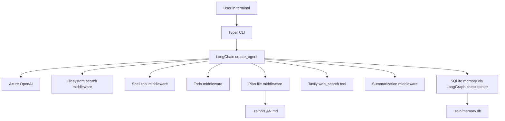

# Zain

<p align="center">
  <strong>A terminal coding agent with workspace memory, enforced planning, shell access, file search, and live docs lookup.</strong>
</p>

<p align="center">
  Built with <code>LangChain</code>, <code>LangGraph</code>, <code>Azure OpenAI</code>, <code>Tavily</code>, and <code>uv</code>.
</p>

---

## What Zain Is

Zain is an interactive coding CLI that works inside a user-provided workspace.
It can inspect files, search the codebase, run shell commands, plan multi-step
work, and resume named conversations from SQLite-backed memory.

It is designed for coding tasks, not generic chat. The agent treats the chosen
workspace as the project root and keeps its work scoped there.

## Highlights

- Workspace-rooted coding agent built with LangChain `create_agent()`
- Azure OpenAI model integration through `AzureChatOpenAI`
- Tavily-backed `web_search` tool for documentation and current references
- Shell execution through LangChain `ShellToolMiddleware` with host execution
- File discovery through `FilesystemFileSearchMiddleware`
- Explicit planning through `TodoListMiddleware`
- `.zain/PLAN.md` plan mirroring and completion verification before final replies
- Long-term conversation memory in `.zain/memory.db`
- Automatic conversation summarization when context usage reaches 90%
- Interactive CLI with named conversation resume support

## Why It Feels Different

Zain is opinionated about agent discipline:

- It plans before doing non-trivial coding work.
- It mirrors active todos into a real file at `.zain/PLAN.md`.
- It pushes the model to work through the plan one item at a time.
- It checks the plan again before the final answer.
- It deletes the plan file before replying once the work is complete.

That gives you a visible execution trail instead of an opaque tool loop.

## Core Workflow

```text
User request
  -> create/update todos
  -> write .zain/PLAN.md
  -> inspect/search/edit/run commands inside workspace
  -> keep todos in sync
  -> verify all plan items are completed
  -> delete .zain/PLAN.md
  -> answer user
```

## Architecture



## Feature Breakdown

### 1. Workspace Scoping

When you start Zain, you pass a working directory:

```bash
uv run zain /path/to/workspace
```

That directory becomes the workspace root. Zain treats it as the project root
for:

- file questions
- code summaries
- shell execution
- repository inspection
- project-level answers

### 2. Persistent Conversations

Zain stores named conversations in SQLite. You must explicitly start or resume a
conversation before chatting:

```text
/start api-refactor
```

If the name exists, Zain resumes it. Otherwise, it creates a new one.

### 3. Plan File Enforcement

For coding work, the agent uses todos and mirrors them into:

```text
.zain/PLAN.md
```

That file acts as a visible checklist for the current task. The agent is
instructed to:

1. create todos first
2. read `PLAN.md`
3. execute work one step at a time
4. update todos as progress changes
5. re-read `PLAN.md` before the final answer
6. delete `PLAN.md`
7. reply only after cleanup

### 4. Web Search

Zain exposes a `web_search` tool backed by Tavily. The agent can use it to find
current documentation, APIs, library references, and external technical context.

### 5. Long-Running Shell Work

Shell commands run on the host machine with the workspace as the working
directory. The default shell command timeout is 60 minutes.

## Tech Stack

| Layer | Choice |
| --- | --- |
| CLI | `Typer` + `Rich` |
| Agent runtime | `LangChain` + `LangGraph` |
| LLM | `Azure OpenAI` |
| Web lookup | `Tavily` |
| Memory | SQLite via `langgraph-checkpoint-sqlite` |
| Package manager | `uv` |

## Project Layout

```text
.
├── pyproject.toml
├── README.md
├── src/
│   └── nirvana_coding_agent/
│       ├── __init__.py
│       ├── __main__.py
│       ├── agent.py
│       ├── cli.py
│       ├── config.py
│       ├── memory.py
│       ├── paths.py
│       └── planning.py
└── .env
```

## Quick Start

### Requirements

- Python 3.11+
- `uv`
- Azure OpenAI credentials
- Tavily API key

### Install

```bash
uv sync
```

### Minimal `.env`

```dotenv
AZURE_OPENAI_API_KEY="your-azure-openai-key"
AZURE_OPENAI_ENDPOINT="https://your-resource.openai.azure.com/openai/responses?api-version=2025-04-01-preview"
AZURE_OPENAI_DEPLOYMENT="gpt-5.2"
TAVILY_API_KEY="your-tavily-key"
```

### Run

```bash
uv run zain /path/to/workspace
```

### Start a Conversation

```text
/start first-session
```

### Example Prompt

```text
Scaffold a new FastAPI project with basic CRUD endpoints, use SQLite for the database, and manage dependencies with uv.
```

## CLI Commands

| Command | Description |
| --- | --- |
| `/start <name>` | Start or resume a named conversation |
| `/conversation` | List saved conversation names |
| `/todos` | Show the current todo list for the active conversation |
| `/help` | Show available commands |
| `/exit` | Exit the CLI |

## State Inside the Workspace

Zain writes runtime state into a hidden workspace folder:

```text
.zain/
├── memory.db
├── memory.db-shm
├── memory.db-wal
└── PLAN.md
```

### What These Files Do

- `memory.db`: stores conversation history and checkpointed state
- `memory.db-shm` / `memory.db-wal`: SQLite sidecar files
- `PLAN.md`: temporary task plan file for the current coding task

If an older workspace still has `.nirvana/memory.db`, Zain copies that database
into `.zain/` on first startup for compatibility.

## Configuration

### Required Environment Variables

| Variable | Purpose |
| --- | --- |
| `AZURE_OPENAI_API_KEY` | Azure OpenAI API key |
| `AZURE_OPENAI_ENDPOINT` | Azure OpenAI endpoint or full Responses URL |
| `AZURE_OPENAI_DEPLOYMENT` | Main deployment name |
| `TAVILY_API_KEY` | Tavily API key for web search |

### Optional Environment Variables

| Variable | Default | Purpose |
| --- | --- | --- |
| `AZURE_OPENAI_MODEL` | deployment name | Override model label |
| `AZURE_OPENAI_SUMMARY_DEPLOYMENT` | main deployment | Separate deployment for summarization |
| `AZURE_OPENAI_SUMMARY_MODEL` | model label | Separate model label for summarization |
| `OPENAI_OUTPUT_VERSION` | `responses/v1` | OpenAI Responses API output version |
| `OPENAI_CONTEXT_WINDOW_TOKENS` | `400000` | Input context window assumption |
| `OPENAI_REQUEST_TIMEOUT_SECONDS` | `180` | Model request timeout |
| `NIRVANA_SUMMARY_TRIGGER_FRACTION` | `0.9` | Summarize once context usage crosses this fraction |
| `NIRVANA_SUMMARY_KEEP_MESSAGES` | `12` | Messages preserved around summarization |
| `NIRVANA_SHELL_TIMEOUT_SECONDS` | `3600` | Shell command timeout |
| `NIRVANA_SHELL_STARTUP_TIMEOUT_SECONDS` | `30` | Shell startup timeout |
| `NIRVANA_SHELL_TERMINATION_TIMEOUT_SECONDS` | `10` | Shell termination timeout |
| `NIRVANA_SHELL_MAX_OUTPUT_LINES` | `300` | Shell output line cap |
| `NIRVANA_SHELL_MAX_OUTPUT_BYTES` | unset | Optional shell output byte cap |
| `NIRVANA_SHELL_PROGRAM` | `/bin/bash` | Shell binary |
| `TAVILY_MAX_RESULTS` | `5` | Tavily result count |

Note: advanced env vars still use the legacy `NIRVANA_` prefix for backward
compatibility.

## How Memory Works

Conversation state is persisted through a SQLite-backed LangGraph checkpointer.
Each conversation uses a `thread_id` equal to the conversation name.

That gives Zain:

- resumable conversations
- persisted todos
- durable agent state across CLI restarts

The implementation also filters transient LangGraph scheduler internals before
writing checkpoints so tool-heavy runs can be serialized safely.

## How Planning Works

Zain combines LangChain's `TodoListMiddleware` with a custom plan-file
middleware.

The result is:

- visible planning in the terminal
- persisted todo state
- a real plan file inside the workspace
- a guard against premature final answers

This is especially useful for code generation, refactors, setup work, and
multi-file changes.

## UX Details

- Zain uses Rich panels and tables for output.
- If Markdown rendering fails, it falls back to plain text instead of crashing.
- Typer pretty-exception rendering is disabled to keep the CLI stable in minimal
  environments.

## Development

### Install dependencies

```bash
uv sync
```

### Run the CLI locally

```bash
uv run zain /path/to/workspace
```

### Verify the code

```bash
uv run python -m compileall src
```

## Roadmap Ideas

- safer write/edit primitives beyond raw shell usage
- richer diff visualization in the CLI
- test runner integration and patch summaries
- optional approval policies for destructive commands
- model/provider profiles beyond Azure OpenAI

## Notes

- The current shell execution policy is host-based, not Docker-isolated.
- The workspace root is the only project scope the agent should assume.
- Web search is available, but used only when the model decides it needs
  external information.

## License

No license file is included yet. Add one before publishing if you want the repo
to be clearly reusable.
